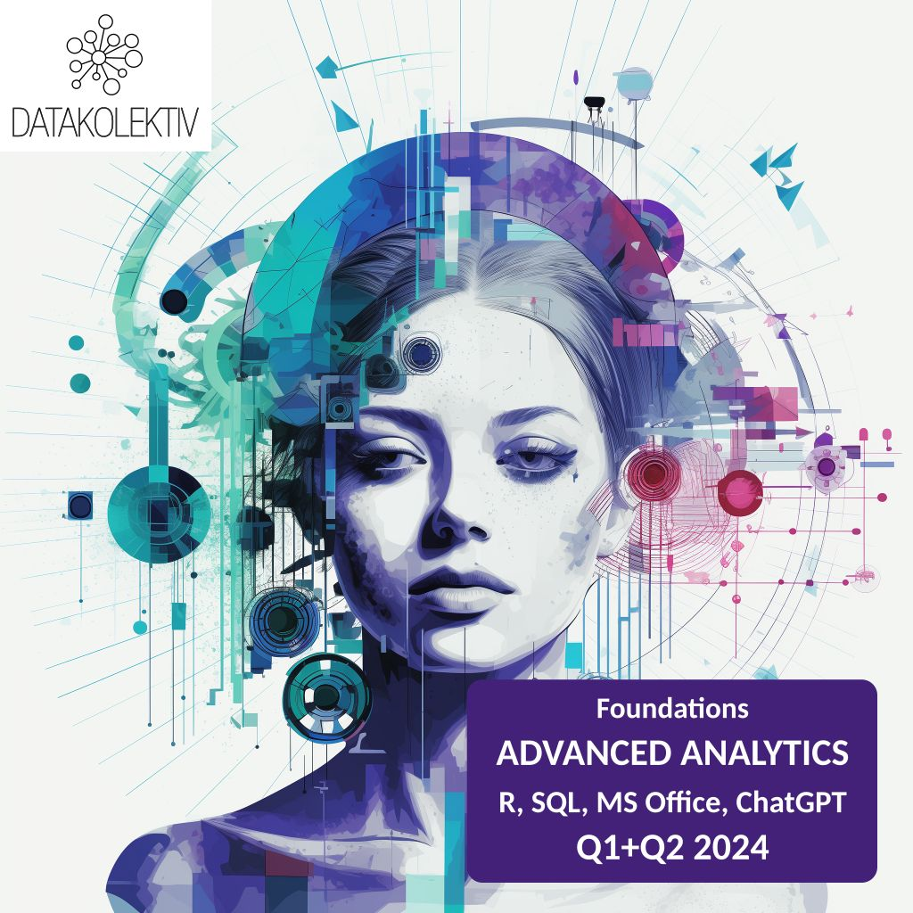

***
# Module 3: Introduction to Predictive Analytics and Forecasting

## Week 06: Time Series Forecasting w. ARIMA
 
### What do we want to do today?

In this session, we embark on an in-depth exploration of Time Series Forecasting with ARIMA, a fundamental technique in the realm of predictive analytics for temporal data. Our journey will begin by grasping the essentials of time series data, characterized by observations ordered in time. We'll then dive into the **ARIMA** (AutoRegressive Integrated Moving Average) model, renowned for its efficacy in capturing the underlying patterns and structures of time series data. Using R and the `forecast` package, we'll learn to build, evaluate, and interpret ARIMA models. This session is not merely about fitting models; it's about leveraging ARIMA to make accurate predictions and gain actionable insights from temporal data. We will cover the theoretical foundations, including the concepts of stationarity, differencing, and autocorrelation, as well as practical aspects such as model selection, parameter estimation, and diagnostic checking.

**Feedback** should be send to `goran.milovanovic@datakolektiv.com`. 
These notebooks accompany the ADVANCED ANALYST - Foundations for Advanced Data Analytics in R [DataKolektiv](http://www.datakolektiv.com/app_direct/DataKolektivServer/) training.

***

### Welcome to R!



## 1. The data set at hand: `Google Trends: Data Science Trends on Google from 2004 to April 2022.` 

We will use the [Google Trends: Data Science Trends on Google from 2004 to April 2022. from Kaggle](https://www.kaggle.com/datasets/muhammedtausif/data-science-trends-on-google?select=March-2023-Data-Science-Trend-multiTimeline.csv) in this session.

```{r echo = T}
# Load the tidyverse package
library(tidyverse)
# Load the forecast package
library(forecast)
# Load the tseries package
library(tseries)
# Load the zoo package
library(zoo)

# The path to your CSV file
data_dir <- paste0(getwd(), "/_data/")
filename <- "data-science-trends-2004-2022-April-17.csv"
filepath <- paste0(data_dir, filename)

# Load the data into R
google_trends <- readr::read_csv(filepath)

# Glimpse its structure to ensure it has arrived in full
glimpse(google_trends)
```

Understanding the `googletrends` data.frame is easy:

- `Month`: year and month (`YYYY-MM`)
- `Data Science (Worldwide)`: Google Trends for `Data Science`, worldwide.

```{r echo = T}
# Rename columns
colnames(google_trends) <- c("Date", "Value")

# Generate summary statistics for the dataset
summary(google_trends)
```

No. Let's inspect this data set in a different way:

```{r echo = T}
# Convert the date column to yearmon type
google_trends$Date <- as.yearmon(google_trends$Date, format="%Y-%m")

# Convert the date column to Date type for plotting
google_trends$Date <- as.Date(google_trends$Date)

# Create the time series object
time_series <- ts(google_trends$Value, 
                  frequency = 12, 
                  start = c(2004, 1))

# Plot the time series data
ggplot(data.frame(Date = google_trends$Date, 
                  Value = google_trends$Value), 
       aes(x = Date, y = Value)) +
  geom_line() +
  labs(title = "Google Trends Data Over Time", 
       x = "Date", 
       y = "Trend Value") +
  theme_minimal()
```

We will decompose the time series into its components: trend, seasonality, and residuals:

```{r echo = T}
# Decompose the time series
decomposed <- decompose(time_series)

# Extract components
trend <- decomposed$trend
seasonal <- decomposed$seasonal
random <- decomposed$random

# Create a data frame with the decomposed components
decomposed_df <- data.frame(
  Date = google_trends$Date,
  Trend = trend,
  Seasonal = seasonal,
  Random = random
)

# Remove rows with NA values
decomposed_df <- na.omit(decomposed_df)

# Pivot the data longer for ggplot2 facet_wrap
decomposed_long <- pivot_longer(decomposed_df, 
                                cols = c("Trend", "Seasonal", "Random"),
                                names_to = "Component", 
                                values_to = "Value")

# Plot the decomposed components with facet_wrap
ggplot(decomposed_long, aes(x = Date, y = Value)) +
  geom_line() +
  facet_wrap(~ Component, 
             scales = "free_y",
             ncol = 1) +
  labs(title = "Decomposed Components of Google Trends Data", 
       x = "Date", 
       y = "Value") +
  theme_minimal()
```

## 2. Introduction to Time-Series Analysis

#### What is Time-Series Analysis?

Time-series analysis is a statistical technique that deals with **time-ordered data**. It involves analyzing data points collected or recorded at specific time intervals to identify patterns, trends, and other characteristics. This type of analysis is particularly useful for understanding how a variable evolves over time and for forecasting future values based on historical data.

#### Key Characteristics of Time-Series Data:

- **Temporal Ordering:** Time-series data is inherently ordered by time, with each observation corresponding to a specific time point.
- **Dependency:** Observations in a time-series are often dependent on previous observations. This dependency can reveal patterns and trends.
- **Components:** Time-series data can have different components such as trend, seasonality, and noise, which can be analyzed separately.

#### Applications of Time-Series Analysis:

- **Economics:** Analyzing stock prices, GDP, inflation rates, etc.
- **Finance:** Forecasting market trends, risk management, etc.
- **Meteorology:** Predicting weather conditions, climate change analysis, etc.
- **Healthcare:** Monitoring and predicting disease outbreaks, patient vital signs, etc.
- **Engineering:** Analyzing system performance, failure prediction, etc.


#### Objectives of Time-Series Analysis:

- **Descriptive Analysis:** Understanding the underlying structure and characteristics of the time-series data.
- **Modeling:** Building models that can explain the observed data and capture the underlying patterns.
- **Forecasting:** Predicting future values based on the historical data and identified patterns.
- **Control and Optimization:** Using time-series models for decision-making and improving processes.

#### Components of Time-Series Data: Trend, Seasonality, and Noise

Time-series data can be decomposed into several components:

- **Trend:** The long-term progression of the series. It represents the overall direction of the data (upward, downward, or flat).
- **Seasonality:** Regular patterns or cycles that repeat over a specific period (e.g., monthly sales peaking during holidays).
- **Noise (Residuals)**: Random variations or irregular fluctuations that cannot be explained by the trend or seasonality.

#### Example Decomposition:

Consider monthly sales data of a retail store over several years:

- Trend: Overall increase in sales over the years.
- Seasonality: Higher sales during holiday seasons.
- Noise: Random fluctuations due to promotions, weather, etc.

## 3. Mathematical Foundations of Time-Series Analysis ARIMA Model

### 3.1 Introduction to Stochastic Processes

A **stochastic process** is a collection of random variables indexed by time. In the context of time-series analysis, it represents the evolution of a system over time. The primary goal is to model the underlying process generating the observed data and make inferences about future observations.

**Mathematical Notation:**
- Let \( \{X_t\}_{t \in T} \) be a stochastic process, where \( t \) represents time.
- \( X_t \) denotes the value of the process at time \( t \).

### 3.2 Stationarity and Differencing

**Stationarity** is a crucial concept in time-series analysis. A time-series is *stationary* if its statistical properties, such as mean and variance, *do not change over time*. Most time-series models, including ARIMA, *assume stationarity*.

**Types of Stationarity:**

1. **Strict Stationarity:** The joint distribution of any set of observations remains the same regardless of time shifts.

2. **Weak Stationarity (Second-Order Stationarity):** The mean, variance, and autocovariance of the series *are constant over time*.

**Mathematical Definition:**

A time-series \( \{X_t\} \) is weakly stationary if:

- \( \mathbb{E}[X_t] = \mu \) (constant mean)
- \( \text{Var}(X_t) = \sigma^2 \) (constant variance)
- \( \text{Cov}(X_t, X_{t+h}) = \gamma(h) \) (autocovariance depends only on lag \( h \))

**Differencing:**

To make a non-stationary series stationary, we can apply **differencing**:

- First difference: \( Y_t = X_t - X_{t-1} \)

- Second difference: \( Y_t = (X_t - X_{t-1}) - (X_{t-1} - X_{t-2}) \)

### 3.3 Autoregressive (AR) Models

An **autoregressive (AR) model** expresses the current value of the series as a linear combination of its previous values.

**AR(p) Model:**
\[ X_t = \phi_1 X_{t-1} + \phi_2 X_{t-2} + \cdots + \phi_p X_{t-p} + \epsilon_t \]
where:
- \( \phi_1, \phi_2, \ldots, \phi_p \) are the parameters of the model.
- \( \epsilon_t \) is white noise with mean zero and constant variance.

### 3.4 Moving Average (MA) Models

A **moving average (MA) model** expresses the current value of the series as a linear combination of past forecast errors (white noise terms).

**MA(q) Model:**

\[ X_t = \mu + \epsilon_t + \theta_1 \epsilon_{t-1} + \theta_2 \epsilon_{t-2} + \cdots + \theta_q \epsilon_{t-q} \]

where:

- \( \mu \) is the mean of the series.

- \( \theta_1, \theta_2, \ldots, \theta_q \) are the parameters of the model.

- \( \epsilon_t \) is white noise with mean zero and constant variance.

### 3.5 Autoregressive Integrated Moving Average (ARIMA) Models

An **ARIMA model** combines the **AR** and **MA** models and **includes differencing** to make the series stationary.

**ARIMA(p, d, q) Model:**

- \( p \): Order of the autoregressive part.

- \( d \): Degree of differencing.

- \( q \): Order of the moving average part.

### 3.6 Autoregressive Integrated Moving Average (ARIMA) Models

An **ARIMA model** combines the AR and MA models and includes differencing to make the series stationary.

**ARIMA(p, d, q) Model:**

- \( p \): Order of the autoregressive part.

- \( d \): Degree of differencing.

- \( q \): Order of the moving average part.

**Model Equation:**

\[ (1 - \phi_1 B - \phi_2 B^2 - \cdots - \phi_p B^p)(1 - B)^d X_t = (1 + \theta_1 B + \theta_2 B^2 + \cdots + \theta_q B^q) \epsilon_t \]

where \( B \) is the backshift operator, \( BX_t = X_{t-1} \).

In the ARIMA model, \( B \) represents the backshift (or lag) operator. The backshift operator \( B \) is used to shift a time series back by a certain number of periods. Specifically, \( B \) applied to a time series \( X_t \) gives:

\[ BX_t = X_{t-1} \]

When we apply \( B \) multiple times, it shifts the series back by more periods:

\[ B^2 X_t = B(BX_t) = B X_{t-1} = X_{t-2} \]
\[ B^p X_t = X_{t-p} \]

These higher-order terms are used to represent lags of the series.

### 3.7 Backshift in the Context of ARIMA and the derivation of the full model equation (OPTIONAL: this has to do with the mathematical notation used in time-series analysis)

##### Autoregressive (AR) Part

In the AR part of the ARIMA model, we use the backshift operator to express lagged values of the time series. For example, in an AR(2) model (where \( p = 2 \)):

\[ X_t = \phi_1 X_{t-1} + \phi_2 X_{t-2} + \epsilon_t \]

This can be written using the backshift operator \( B \):

\[ X_t = \phi_1 B X_t + \phi_2 B^2 X_t + \epsilon_t \]

or

\[ (1 - \phi_1 B - \phi_2 B^2) X_t = \epsilon_t \]

##### Differencing (I) Part

The differencing part of the ARIMA model uses the backshift operator to express differences. For example, if we take the first difference (where \( d = 1 \)):

\[ \Delta X_t = X_t - X_{t-1} \]

This can be written using the backshift operator \( B \):

\[ \Delta X_t = (1 - B) X_t \]

For the second difference (where \( d = 2 \)):

\[ \Delta^2 X_t = (X_t - X_{t-1}) - (X_{t-1} - X_{t-2}) = X_t - 2X_{t-1} + X_{t-2} \]

This can be written using the backshift operator \( B \):

\[ \Delta^2 X_t = (1 - B)^2 X_t \]

##### Moving Average (MA) Part

In the MA part of the ARIMA model, we use the backshift operator to express lagged error terms. For example, in an MA(2) model (where \( q = 2 \)):

\[ X_t = \epsilon_t + \theta_1 \epsilon_{t-1} + \theta_2 \epsilon_{t-2} \]

This can be written using the backshift operator \( B \):

\[ X_t = \epsilon_t + \theta_1 B \epsilon_t + \theta_2 B^2 \epsilon_t \]

or

\[ X_t = (1 + \theta_1 B + \theta_2 B^2) \epsilon_t \]

##### Full ARIMA Model Equation

Combining these parts, the full ARIMA(p, d, q) model equation is:

\[ (1 - \phi_1 B - \phi_2 B^2 - \cdots - \phi_p B^p)(1 - B)^d X_t = (1 + \theta_1 B + \theta_2 B^2 + \cdots + \theta_q B^q) \epsilon_t \]

where:

- \( (1 - \phi_1 B - \phi_2 B^2 - \cdots - \phi_p B^p) \) represents the autoregressive part,

- \( (1 - B)^d \) represents the differencing part,

- \( (1 + \theta_1 B + \theta_2 B^2 - \cdots + \theta_q B^q) \) represents the moving average part,

- \( \epsilon_t \) is the error term (white noise).

After rearranging:

\[
X_t = \left( \frac{1 + \theta_1 B + \theta_2 B^2 + \cdots + \theta_q B^q}{1 - \phi_1 B - \phi_2 B^2 - \cdots - \phi_p B^p} \right) (1 - B)^d \epsilon_t
\]


## 4.Testing for Stationarity

### 4.1 Visual Inspection

**Plot the Time Series:** The first step is often to visually inspect the time-series plot. Non-stationary series typically show trends, seasonality, or changing variance over time.

### 4.2 Summary Statistics

**Rolling Statistics:** Compute rolling mean and rolling standard deviation over time. For a stationary series, these statistics should remain constant over time.

### 4.3 Augmented Dickey-Fuller (ADF) Test

Several statistical tests can formally assess stationarity. The most commonly used test is the **Augmented Dickey-Fuller (ADF) Test**:

- Null Hypothesis: The series has a unit root (i.e., it is non-stationary).

- Alternative Hypothesis: The series is stationary.

- Procedure: The test involves regressing the first difference of the series against the lagged level of the series and lagged differences to account for higher-order autoregressive processes.

R has a function for this test, of course: `adf.test()`:

```{r echo = T}
adf.test(time_series)
```

Interpretation:

- *Null Hypothesis (H0)*: The time series is non-stationary.

- *Alternative Hypothesis (H1)*: The time series is stationary.

Decision Rule:

- If the *p-value is less than a chosen significance level (e.g., 0.05)*, we reject the null hypothesis and conclude that the time series is **stationary**.

- If the *p-value is greater than the chosen significance level*, we fail to reject the null hypothesis and conclude that the time series is **non-stationary**.

Because `p-value = 0.9241` is much greater than the typical significance level of 0.05, we fail to reject the null hypothesis. This means we do not have enough evidence to conclude that the time series is stationary. Therefore, based on this ADF test result, the time series is non-stationary.

Now, let's difference the time-series data at hand and check if it becomes stationary (or at least if the ADF test shows that it can be rejected that it is non-stationary) and plot the differencing result:

```{r echo = T}
diff1 <- diff(time_series, differences = 1)
adf.test(diff1)
plot(diff1, 
     main = "First Differenced Series", 
     ylab = "Differenced Values", 
     xlab = "Time")
```

So, this time we have achieved stationarity following the first-order differencing only.

## 5. ARIMA w. `forecast` in R

#### Google Trends w. ARIMA

Obviously, many different ARIMA models exist for the same data, each defined by their *p*, *q*, and *d* parameters. How can we use the `forecast` package to determine the optimal model for our time-series data set? Use `auto.arima()`:

```{r echo = T}
ts_model <- auto.arima(time_series)
summary(ts_model)
```

But the output is a bit more complicated than `[p, d, q]`, right..? That is because the optimal ARIMA model for our data has modeled the trend component separately from the seasonal component of the time-series - and thus we get two sets of parameters! 

#### Understanding the ARIMA Model Output

1. **Model Specification:**
   ```
   ARIMA(2,2,2)(0,0,2)[12]
   ```
   - **ARIMA(2,2,2):** This indicates the **non-seasonal part of the model** with:
     - \( p = 2 \): Order of the autoregressive part.
     - \( d = 2 \): Degree of differencing needed to make the series stationary.
     - \( q = 2 \): Order of the moving average part.
   - **(0,0,2)[12]:** This indicates the **seasonal part of the model** with:
     - Seasonal \( p = 0 \): Order of the seasonal autoregressive part.
     - Seasonal \( d = 0 \): Degree of seasonal differencing.
     - Seasonal \( q = 2 \): Order of the seasonal moving average part.
     - \([12]\): The periodicity of the seasonality (e.g., 12 for monthly data).


2. **Coefficients:**
   ```
          ar1      ar2      ma1      ma2    sma1    sma2
      -0.8383  -0.1729  -0.3598  -0.6198  0.4424  0.4200
   s.e.  0.3911  0.0908  0.3895  0.3855  0.0690  0.0804
   ```
   - **ar1, ar2:** Coefficients for the autoregressive terms.
   - **ma1, ma2:** Coefficients for the moving average terms.
   - **sma1, sma2:** Coefficients for the seasonal moving average terms.
   - **s.e.:** Standard errors of the coefficients, indicating the precision of the coefficient estimates.


3. **Model Fit Statistics:**
   ```
   sigma^2 = 6.93:  log likelihood = -521.79
   AIC=1057.58   AICc=1058.11   BIC=1081.27
   ```
   - **sigma^2:** The variance of the residuals (errors).
   - **log likelihood:** A measure of how well the model fits the data. Higher values indicate a better fit.
   - **AIC (Akaike Information Criterion):** Used for model selection; lower values indicate a better model.
   - **AICc:** AIC corrected for small sample sizes.
   - **BIC (Bayesian Information Criterion):** Similar to AIC but with a stronger penalty for models with more parameters; lower values indicate a better model.


4. **Training Set Error Measures:**
   ```
                    ME     RMSE      MAE      MPE     MAPE      MASE        ACF1
   Training set 0.2041823 2.584164 1.555493 0.368802 10.50522 0.2565761 -0.01493061
   ```
   - **ME (Mean Error):** Average of the residuals. Close to zero is better.
   - **RMSE (Root Mean Square Error):** Square root of the average squared errors. Lower values indicate a better fit.
   - **MAE (Mean Absolute Error):** Average of the absolute errors. Lower values indicate a better fit.
   - **MPE (Mean Percentage Error):** Average of the percentage errors. Close to zero is better.
   - **MAPE (Mean Absolute Percentage Error):** Average of the absolute percentage errors. Lower values indicate a better fit.
   - **MASE (Mean Absolute Scaled Error):** Compares the MAE to the MAE of a naïve model. Values less than 1 indicate a better model than the naïve model.
   - **ACF1 (Autocorrelation of Residuals at Lag 1):** Measures the correlation of residuals at lag 1. Values close to zero indicate no autocorrelation in residuals.

##### Summary

The `auto.arima()` function automatically selected an `ARIMA(2,2,2)(0,0,2)[12]` model for your time series data. This model has two autoregressive terms, two differencing operations to achieve stationarity, two moving average terms, and two seasonal moving average terms with a periodicity of 12. **Note.** The autoregressive and differencing terms for the seasonal model component are in this case `0`: there are no seasonal autoregressive terms and no seasonal differencing in this model. 

The coefficients for these terms are provided along with their standard errors. The model fit statistics (sigma^2, log likelihood, AIC, AICc, BIC) indicate how well the model fits the data, with lower AIC and BIC values indicating a better fit.

The training set error measures provide insights into the accuracy of the model's predictions, with lower values indicating better performance and values of ACF1 close to zero indicating that the residuals do not exhibit significant autocorrelation.

## 6. Forecasting from an ARIMA model w. `forecast`

The final data point in our time-series data on Google trends was `2022-04-01`. We can use `forecast()` to make our `ts_model` predict the values until the end of 2024 (since we're beginning in May 2022, there are thirty-two remaining months to forecast):

```{r echo = T}
forecasted_values <- forecast(ts_model, h = 32)
print(forecasted_values)
```

```{r echo = T}
# Convert the forecasted values into a data frame
forecast_df <- data.frame(
  Date = seq(as.Date("2022-05-01"), 
             by = "month", 
             length.out = 32),
  Forecast = forecasted_values$mean,
  Lo80 = forecasted_values$lower[,1],
  Hi80 = forecasted_values$upper[,1],
  Lo95 = forecasted_values$lower[,2],
  Hi95 = forecasted_values$upper[,2]
)

# Convert the time_series object into a data frame
time_series_df <- data.frame(
  Date = seq(as.Date("2004-01-01"), by = "month", length.out = length(time_series)),
  Value = as.numeric(time_series)
)

# Combine historical data and forecasted data
combined_df <- rbind(
  time_series_df,
  data.frame(Date = forecast_df$Date, Value = NA)
)

# Plot the historical data and forecasted values
ggplot() +
  geom_line(data = time_series_df, aes(x = Date, y = Value), color = "blue") +
  geom_line(data = forecast_df, aes(x = Date, y = Forecast), color = "red") +
  geom_ribbon(data = forecast_df, aes(x = Date, ymin = Lo80, ymax = Hi80), alpha = 0.2, fill = "orange") +
  geom_ribbon(data = forecast_df, aes(x = Date, ymin = Lo95, ymax = Hi95), alpha = 0.1, fill = "green") +
  labs(title = "Time Series Forecast with Prediction Intervals",
       x = "Date",
       y = "Value") +
  theme_minimal()
```
Notice how the precision of the model's prediction is getting lower and lower as we advance more towards future data points!  

## 7. Case Study: Global Climate Change

We will use the [Global Climate Change Data](https://data.world/data-society/global-climate-change-data) from Kaggle.

```{r echo = T}
data_set <- read_csv(paste0(data_dir, "GlobalTemperatures.csv"))
head(data_set)
```

There are some missing values in `LandAverageTemperature`:

```{r echo = T}
sum(is.na(data_set$LandAverageTemperature))
```

You can use [`na.interp()`](https://www.rdocumentation.org/packages/forecast/versions/8.22.0/topics/na.interp) from the `forecats` package to interpolate missing data points in time series. Prepare time-series data:

```{r echo = T}
# Handle NA values
time_series_data <- na.interp(data_set$LandAverageTemperature)

# Create the time series object
time_series <- ts(time_series_data, 
                  frequency = 12, 
                  start = c(1750, 1))
```

Decompose the time series:

```{r echo = T}
# Decompose the time series
decomposed <- decompose(time_series)

# Extract components
trend <- decomposed$trend
seasonal <- decomposed$seasonal
random <- decomposed$random

# Create a data frame with the decomposed components
decomposed_df <- data.frame(
  Date = data_set$dt,
  Trend = trend,
  Seasonal = seasonal,
  Random = random
)

# Remove rows with NA values
decomposed_df <- na.omit(decomposed_df)

# Pivot the data longer for ggplot2 facet_wrap
decomposed_long <- pivot_longer(decomposed_df, 
                                cols = c("Trend", "Seasonal", "Random"),
                                names_to = "Component", 
                                values_to = "Value")

# Plot the decomposed components with facet_wrap
ggplot(decomposed_long, aes(x = Date, y = Value)) +
  geom_line() +
  facet_wrap(~ Component, 
             scales = "free_y",
             ncol = 1) +
  labs(title = "Decomposed Components of Google Trends Data", 
       x = "Date", 
       y = "Value") +
  theme_minimal()
```

ARIMA:

```{r echo = T}
ts_model <- auto.arima(time_series)
summary(ts_model)
```

### Interpretation of ARIMA Model Output

**Series: time_series**
- This indicates the name of the time series data being modeled.

**ARIMA(5,0,1)(2,1,0)[12] with drift**

- **ARIMA(p,d,q)**: This notation represents the ARIMA model structure.
  - **p (5)**: The order of the autoregressive part (AR). This means the model includes 5 lagged values of the time series.
  - **d (0)**: The degree of differencing. Here, it is 0, indicating that the time series is already stationary, and no differencing was needed.
  - **q (1)**: The order of the moving average part (MA). This means the model includes 1 lagged forecast error term.
  
- **(P,D,Q)[m]**: This notation represents the seasonal part of the ARIMA model.
  - **P (2)**: The order of the seasonal autoregressive part. This means the model includes 2 lagged seasonal values.
  - **D (1)**: The degree of seasonal differencing. This indicates one seasonal differencing was applied.
  - **Q (0)**: The order of the seasonal moving average part. This means no seasonal moving average terms were included.
  - **m (12)**: The period of the seasonality. Here, 12 suggests monthly data with yearly seasonality.

- **with drift**: Indicates that the model includes a constant term (drift).

### Coefficients

- **ar1, ar2, ... ar5**: These are the coefficients for the autoregressive terms.
- **ma1**: This is the coefficient for the moving average term.
- **sar1, sar2**: These are the coefficients for the seasonal autoregressive terms.
- **drift**: This is the constant term in the model.

**Standard Error (s.e.)**: These values provide an estimate of the variability of the coefficient estimates. Smaller values indicate more precise estimates.

### Model Fit Statistics

- **sigma^2 = 0.7534**: This is the estimate of the variance of the residuals (errors) in the model. Smaller values indicate a better fit.
- **log likelihood = -4060.01**: This value is used in model comparison and selection criteria.
- **AIC = 8140.02**: Akaike Information Criterion. A lower AIC indicates a better-fitting model.
- **AICc = 8140.09**: Corrected Akaike Information Criterion for small sample sizes. Similar interpretation to AIC.
- **BIC = 8200.67**: Bayesian Information Criterion. Like AIC, but penalizes more complex models more heavily. Lower values are better.

### Training Set Error Measures

- **ME (Mean Error)**: Average of the errors. Close to zero indicates unbiased predictions.
- **RMSE (Root Mean Square Error)**: Measures the average magnitude of the error. Lower values indicate better fit.
- **MAE (Mean Absolute Error)**: Average absolute error. Lower values indicate better fit.
- **MPE (Mean Percentage Error)**: Average percentage error. 
- **MAPE (Mean Absolute Percentage Error)**: Average absolute percentage error. Lower values indicate better fit.
- **MASE (Mean Absolute Scaled Error)**: Scale-invariant measure of error. Lower values indicate better fit.
- **ACF1 (Autocorrelation of residuals at lag 1)**: Close to zero indicates no significant autocorrelation in the residuals, suggesting a good fit.

Now, forecast:

```{r echo = T}
forecasted_values <- forecast(ts_model, h = 120)
print(forecasted_values)
```

```{r echo = T}
# Convert the forecasted values into a data frame
forecast_df <- data.frame(
  Date = seq(as.Date("2016-01-01"), 
             by = "month", 
             length.out = 120),
  Forecast = forecasted_values$mean,
  Lo80 = forecasted_values$lower[,1],
  Hi80 = forecasted_values$upper[,1],
  Lo95 = forecasted_values$lower[,2],
  Hi95 = forecasted_values$upper[,2]
)

# Convert the time_series object into a data frame
# Convert the time_series object into a data frame
time_series_df <- data.frame(
  Date = seq(as.Date("1750-01-01"), 
             by = "month", 
             length.out = length(time_series)),
  Value = as.numeric(time_series)
)

# Combine historical data and forecasted data
combined_df <- rbind(
  time_series_df,
  data.frame(Date = forecast_df$Date, Value = NA)
)

# Plot the historical data and forecasted values
ggplot() +
  geom_line(data = time_series_df, aes(x = Date, y = Value), color = "blue") +
  geom_line(data = forecast_df, aes(x = Date, y = Forecast), color = "red") +
  geom_ribbon(data = forecast_df, aes(x = Date, ymin = Lo80, ymax = Hi80), alpha = 0.2, fill = "orange") +
  geom_ribbon(data = forecast_df, aes(x = Date, ymin = Lo95, ymax = Hi95), alpha = 0.1, fill = "green") +
  labs(title = "LandAverageTemperature Forecast with Prediction Intervals",
       x = "Date",
       y = "Value") +
  theme_minimal()
```

### Books and Tutorials

- [Forecasting: Principles and Practice (2nd ed), Rob J Hyndman and George Athanasopoulos, Monash University, Australia](https://otexts.com/fpp2/) - This is an **absolute must-read** for anyone seriously interested in time-series analysis!

### Videos

- [Time Series Talk: Stationarity](https://www.youtube.com/watch?v=oY-j2Wof51c)
- [Basic Time Series in R and RStudio, Scott Burk](https://www.youtube.com/playlist?list=PLX-TyAzMwGs-I3i5uiCin37VFMSy4c50F)


### R Markdown

[R Markdown](https://rmarkdown.rstudio.com/) is what I have used to produce this beautiful Notebook. We will learn more about it near the end of the course, but if you already feel ready to dive deep, here's a book: [R Markdown: The Definitive Guide, Yihui Xie, J. J. Allaire, Garrett Grolemunds.](https://bookdown.org/yihui/rmarkdown/) 


***
Goran S. Milovanović

DataKolektiv, 2024.

contact: goran.milovanovic@datakolektiv.com


***
License: [GPLv3](http://www.gnu.org/licenses/gpl-3.0.txt)
This Notebook is free software: you can redistribute it and/or modify it under the terms of the GNU General Public License as published by the Free Software Foundation, either version 3 of the License, or (at your option) any later version.
This Notebook is distributed in the hope that it will be useful, but WITHOUT ANY WARRANTY; without even the implied warranty of MERCHANTABILITY or FITNESS FOR A PARTICULAR PURPOSE.  See the GNU General Public License for more details.
You should have received a copy of the GNU General Public License along with this Notebook. If not, see <http://www.gnu.org/licenses/>.

***

