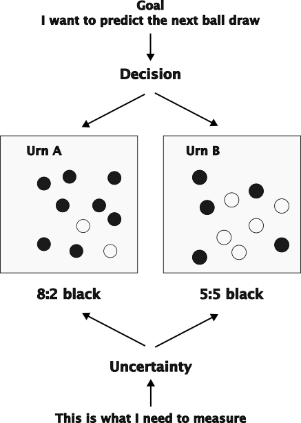

***
# Module 6: Advanced Supervised and Unsupervised Models

## Week 12: An Introduction to Decision Tree Modelling

### What do we want to do today?

Here's an introduction for your Decision Tree modeling session:

### Exploring Decision Trees: A Gateway to Predictive Modeling

In this session, we delve into the intuitive yet powerful method of **Decision Tree Modeling**, a cornerstone in both classification and regression tasks in machine learning. Decision Trees help in making sense of complex data by breaking down our decision-making process into a simple, visual hierarchy of decisions based on our data's features. This makes them not only easy to understand and interpret but also extremely effective in handling varied data types and relationships.

Using R, we will learn how to construct, evaluate, and optimize Decision Trees. We will rely on the [{rpart}](https://cran.r-project.org/web/packages/rpart/index.html) package which encompasses some very well studied procedures to grow **CART** (*Classification and Regression Trees*). We begin by solving a regression problem tree with {rpart} and introduce the theory of CART along the way. We then proceed to solve a classification problem with a Decision Tree model and introduce the elements of Information Theory to understand the criteria used to assess the model. Enters **entropy**: the fundamental concept of Information Theory and among the corner stones of contemporary statistical learning. Finally we introduce the tree post-pruning procedures - essentially cross-validation across the model control parameters - and contrast it to tree post-pruning based on the *complexity parameter*.

**Feedback** should be send to `goran.milovanovic@datakolektiv.com`. 

These notebooks accompany the ADVANCED ANALYST - Foundations for Advanced Data Analytics in R [DataKolektiv](http://www.datakolektiv.com/app_direct/DataKolektivServer/) training.

***

### Welcome to R!


Setup:

```{r echo = T}
# Packages
library(tidyverse)
library(rpart)
library(rpart.plot)

# Directory Tree
data_dir <- paste0(getwd(), "/_data/")
```

Grab the `HR_comma_sep.csv` dataset from the [Kaggle](https://www.kaggle.com/liujiaqi/hr-comma-sepcsv) and place it in your `_data` directory for this session. We will also use the [Boston Housing Dataset:  BostonHousing.csv](https://raw.githubusercontent.com/selva86/datasets/master/BostonHousing.csv)

### 1. CART: The regression problem

We begin by loading and inspecting the Boston Housing dataset.

```{r echo = T, message = F, warning = F}
dataSet <- read.csv(paste0(data_dir, 'BostonHousing.csv'), 
                    header = T, 
                    check.names = F,
                    stringsAsFactors = F)
head(dataSet)
```

```{r echo = T, message = F, warning = F}
glimpse(dataSet)
```

Here are the variables:

+ **crim**: per capita crime rate by town
+ **zn**: proportion of residential land zoned for lots over 25,000 sq.ft.
+ **indus**: proportion of non-retail business acres per town.
+ **chas**: Charles River dummy variable (1 if tract bounds river; 0 otherwise)
+ **nox**: nitric oxides concentration (parts per 10 million)
+ **rm**: average number of rooms per dwelling
+ **age**: proportion of owner-occupied units built prior to 1940
+ **dis**: weighted distances to five Boston employment centers
+ **rad**: index of accessibility to radial highways
+ **tax**: full-value property-tax rate per $10,000
+ **ptratio**: pupil-teacher ratio by town
+ **b**: 1000(Bk - 0.63)^2 where Bk is the proportion of blacks by town
+ **lstat**: % lower status of the population
+ **medv**: Median value of owner-occupied homes in $1000's

The `medv` variable is the *outcome*.

```{r echo = T, message = F, warning = F}
ggplot(dataSet, 
       aes(x = medv)) + 
  geom_histogram(fill = "blue", 
                 color = "blue", 
                 bins = 30) + 
  theme_bw() + 
  theme(panel.border = element_blank())
```

Now the {rpart} model:

```{r echo = T, message = F, warning = F}
regTree1 <- rpart(
  formula = medv ~ .,
  data = dataSet,
  method  = 'anova',
  control = rpart.control(cp = 0)
  )
```

**N.B.** Use the `anova` method to instruct {rpart} to fit a **regression tree**. The package will try to make an intelligent guess based on the nature of the outcome variable, however it is probably wiser to instruct it. Never mind the `control = rpart.control(cp = 0)` part for now. 

Let' see: use `rpart.plot()` to visualize the Decision Tree:

```{r echo = T, message = F, warning = F}
rpart.plot(regTree1,
           type = 4,
           extra = "auto")
```

Nothing can be seen? I know. Give me a chance I will fix this later in this Session.

The visualization works like this: wherever a decision (a split) is made, we go **left** for `TRUE` on the respective condition, and **right** for `FALSE`. 

In the tree representation above, each node shows the predicted value and the percentage of cases falling under it. We will not post-prune this tree model now (as we did in the previous session); that can wait. First we need a bit of theory only to understand how trees like this are grown.

```{r echo = T, message = F, warning = F}
predictions <- predict(regTree1, 
                       newdata = dataSet)

plotFrame <- data.frame(predictions = predictions, 
                        observations = dataSet$medv)
ggplot(data = plotFrame,
       aes(x = predictions,
           y = observations)) + 
  geom_smooth(size = .25, color = "red", method = "lm") +
  geom_point(size = 1, color = "blue") + 
  geom_point(size = .75, color = "white") + 
  ggtitle("Regression Tree Prediction") + 
  theme_bw() + 
  theme(panel.border = element_blank()) +
  theme(plot.title = element_text(hjust = .5))
```

To put it in a nutshell: a Regression Decision Tree model partitions the dataset into subgroups, and then fits a **constant** for each case found in each subgroup. That constant is nothing more than the mean of all observations in the subgroup.  

Basic regression trees partition a data set into smaller subgroups and then fit a simple constant for each observation in the subgroup. The partitioning is achieved by successive binary partitions (aka *recursive partitioning*) based on the different predictors. The constant to predict is based on *the average values* for all observations that fall in that subgroup.

The fundamental model equation is surprisingly simple then. Let's index the subgroups (regions) as $m = 1, 2,.., M$. Imagine we deal with $N$ predictors in $X$. The predicted value for any observation $\hat{f}(X)$ is the sum of the $c_m$ values - the region (subgroup) means multiplied by and indicator function $I(X)$ which simply tells us if some particular observation falls into some region $R_m$ or not (taking values of `1` and `0`, respectively): 

$$\hat{f}(X)=\sum_{m=1}^{M}{c_mI(X_1, X_2,.., X_N)\in{R_m}}$$
But everything is easy if we already *know* the regions defined by splits across the predictor in the tree. But how do we learn about them? How do we grow trees?

The tree grows by a method known as **binary recursive partitioning**. The method is known as *greedy*: it begins by taking the whole dataset and splits it into two regions so as to minimize the sum of squared errors as much as possible, but once the split is made *it does not affect* the later splits. The process continues recursively across the newly obtained regions, each being split into two regions where sum of squared errors are minimized:

$$SSE=\Bigg\{\sum_{i\in{R_1}}(y_i-c_1)^2+\sum_{i\in{R_2}}(y_i-c_2)^2\Bigg\}$$

The recursive partitioning continues until some criterion is met (for example, the minimum allowed number of observations in a terminal node). And that is the critical part in growing a Decision Tree **because** complex models like them can *easily overfit* the data by finding smaller and smaller regions in the space spawned by the model predictors, theoretically isolating each particular value of the outcome - or very, very small subsets of their values - in highly idyosincratic regions!

> Overfitting is a common issue in machine learning where a model learns the details and noise in the training data to an extent that it negatively impacts the performance of the model on new data. Think of it as a student who memorizes facts for a test rather than understanding the concepts. The student might do well on that particular test, but fails to apply the knowledge to different questions or subjects. Similarly, an overfitted model performs well on its training data but often fails to make accurate predictions on data it hasn't seen before because it has adapted too closely to the particular examples, rather than understanding the underlying patterns. 
To avoid overfitting, we can use techniques such as simplifying the model by reducing the number of parameters, or by using methods like cross-validation, where the data is divided into parts, some of which are used for training and others for validating the model's performance. Regularization methods can also be applied, which effectively add a penalty for complexity, encouraging the model to be simpler and focusing more on the major trends rather than the detailed noise in the data.

Now, how do we avoid **overfitting (to be explained in the Session)** in the Decision Tree model? There are **two ways** to do it. The first is called **pre-pruning** and essentially means performing a cross-validation across the model controlling parameters interpreted as stopping rules. We will focus on pre-pruning later on in this session. Now we want to understand the **post-pruning** approach. It is based on the value of the *complexity criterion* which is calculated as the tree grows in recursive partitioning, on the fly. The post-pruning solution to prevent the tree from overfitting the data is the following one (to be explained):

Instead of minimizing

$$SSE=\Bigg\{\sum_{i\in{R_1}}(y_i-c_1)^2+\sum_{i\in{R_2}}(y_i-c_2)^2\Bigg\}$$

we choose to minimize

$$SSE_{penalized}=\Bigg\{\sum_{i\in{R_1}}(y_i-c_1)^2+\sum_{i\in{R_2}}(y_i-c_2)^2\Bigg\} + \alpha|T|$$

where $\alpha$ is the *cost complexity parameter* and $|T|$ is the *number of terminal nodes in the tree*. Post-pruning works in the following way:

- fit a large tree, a complex model to the data;
- start looking for *subtrees* of that tree that have the minimal $SSE_{penalized}$
- across a range of values for $\alpha$; for each selected subtree
- perform a k-fold cross-validation across $\alpha$ and determine the *cross-validation (i.e. prediction) error*;
- choose the substree with a minimal cross-validation error found on a particular value of $\alpha$.

Let's perform post-pruning in R. We need to take a look at the *complexity parameter table* which is found in `regTree1$cptable` field of the model object:

```{r echo = T, message = F, warning = F}
print(regTree1$cptable)
```

We can also visualize it with `plotcp()`:

```{r echo = T, message = F, warning = F}
plotcp(regTree1)
```

Can you see how the value of `xerror` stabilizes at some point and maybe even begin to grow slightly? Remember how we used `control = rpart.control(cp = 0)` in our model call: we have instructed `rpart()` to set $\alpha$ to `0` and produced a tree that overfits the data!

Now, post-pruning: look at the *complexity parameter table* and find the value of `CP` for the lowest `xerror`:

```{r echo = T, message = F, warning = F}
cptable <- as.data.frame(regTree1$cptable)

optimal_cp <- cptable$CP[which.min(cptable$xerror)]

optimalregTree1 <- prune(regTree1,
                         cp = optimal_cp)

rpart.plot(optimalregTree1,
           type = 4,
           extra = "auto")
```

(I told you I will fix it ^^)

```{r echo = T, message = F, warning = F}
print(optimal_cp)
```

From the `rpart()` [documentation](https://www.rdocumentation.org/packages/rpart/versions/4.1-15/topics/rpart.control):

> complexity parameter. Any split that does not decrease the overall lack of fit by a factor of cp is not attempted. For instance, with anova splitting, this means that the overall R-squared must increase by cp at each step. The main role of this parameter is to save computing time by pruning off splits that are obviously not worthwhile. Essentially,the user informs the program that any split which does not improve the fit by cp will likely be pruned off by cross-validation, and that hence the program need not pursue it.

```{r echo = T, message = F, warning = F}
predictions <- predict(optimalregTree1, 
                       newdata = dataSet)
plotFrame <- data.frame(predictions = predictions, 
                        observations = dataSet$medv)
ggplot(data = plotFrame,
       aes(x = predictions,
           y = observations)) + 
  geom_smooth(size = .25, color = "red", method = "lm") +
  geom_point(size = 1, color = "blue") + 
  geom_point(size = .75, color = "white") + 
  ggtitle("Regression Tree Prediction") + 
  theme_bw() + 
  theme(panel.border = element_blank()) +
  theme(plot.title = element_text(hjust = .5))
```

However, let's take a look at an even simpler model. Let's not use the `cp` control parameter and just let {rpart} grow the tree on its own:

```{r echo = T, message = F, warning = F}
regTree2 <- rpart(
  formula = medv ~ .,
  data = dataSet,
  method  = 'anova')
rpart.plot(regTree2,
           type = 4,
           extra = "auto")
```

Now the visualization finally helps, at least.

```{r echo = T, message = F, warning = F}
plotcp(regTree2)
```

What criteria has been used on behalf of `rpart()` to grow this tree?

```{r echo = T, message = F, warning = F}
regTree2$control$cp
```

So please be aware of the default values of the control parameters in large and complex statistical learning models!

The $R^2$ of the optimal model, if you are interested to learn, is:

```{r echo = T, message = F, warning = F}
predictions <- predict(regTree2, 
                       newdata = dataSet)
round(
  cor(predictions, dataSet$medv)^2, 
  2)
```

```{r echo = T, message = F, warning = F}
predictions <- predict(regTree1, 
                       newdata = dataSet)
round(
  cor(predictions, dataSet$medv)^2, 
  2)
```

```{r echo = T, message = F, warning = F}
plotFrame <- data.frame(predictions = predictions, 
                        observations = dataSet$medv)
ggplot(data = plotFrame,
       aes(x = predictions,
           y = observations)) + 
  geom_smooth(size = .25, color = "red", method = "lm") +
  geom_point(size = 1, color = "blue") + 
  geom_point(size = .75, color = "white") + 
  ggtitle("Regression Tree Prediction") + 
  theme_bw() + 
  theme(panel.border = element_blank()) +
  theme(plot.title = element_text(hjust = .5))
```

### 2. CART: The classification problem

Growing a Classification Tree is a little bit different than growing a Regression Tree, for one simple, obvious reason that we have already encountered in our discussions of Generalized Linear Models: namely, minimizing $SSE$ is not an ideal goal anymore. We need some new criteria for our algorithms to decide when a new split is useful and when not. Let's see what can be done about it.

#### 2.1 Elements of Information Theory: enters Entropy

Imagine a tree-growing algorithm running for a two-class classification problem, ending up in a set of regions in the space spawned by the predictors. Each region potentially contains both correctly and incorrectly classified instances of the outcome. I want to measure how "pure" a region is: how well does it delineates truth from falsehood in classification.

Consider a coin toss statistical experiment with $p = .23$ and 100 observations:

```{r echo = T, message = F, warning = F}
exp <- rbinom(n = 100, size = 1, prob = .23)
table(exp)
```

As expected, there are way more `0s`, given the low probability of just `.23` to observe `1. Of course, the probability $p = .50$ of a fair coin would produce a different distribution of results:

```{r echo = T, message = F, warning = F}
exp <- rbinom(n = 100, size = 1, prob = .5)
table(exp)
```

**Q.** Which of these two distributions is more **informative**? What brings more knowledge to us: an outcome of a fair coin toss which brings about `1` and `0` with an approximately 50:50 distribution, or a toss of a coin with $p = .23$? Which outcome does bring more **surprise** to us? 

What we can tell about the two coins: which one is more **predictable**. Obviously, the coin with $p = .23$ is way more predictable than the fair coin which carries complete uncertainty about its outcome. There is somehow more structure in the uneven distribution of outcomes with $p = .23$ than in the distribution of outcomes of a fair coin toss.

**Information theory**, developed by Claude Shannon in the mid-20th century, provides a mathematical framework for understanding how information is processed, transmitted, and stored. A fundamental concept in this field is **surprise** (aka **information content**) which quantifies how unexpected an event is in a probabilistic setting. Shannon defined the surprise of an event \( x \) occurring with probability \( p(x) \) as \( -\log(p(x)) \). This definition is intuitive: the less probable an event, the more surprising it is, and thus it carries more information. For example, a rare event (low probability) is more surprising and provides more information when it occurs compared to a common event.

The choice of the logarithmic function in this formulation is crucial. The logarithm allows us to measure information in such a way that if two independent events happen together, the total surprise is the sum of the individual surprises, corresponding to the logarithmic rule \( \log(ab) = \log(a) + \log(b) \). This property helps in building a scalable and additive information metric.

```{r echo = T, message = F, warning = F}
# Create a dataframe with probabilities and their corresponding surprise
data <- data.frame(probability = seq(0.01, 1, by = 0.01))
data$surprise = -log(data$probability)

# Plot using ggplot2
ggplot(data, aes(x = probability, y = surprise)) +
  geom_line(color = "blue", size = .5) +
  labs(title = "Surprise vs. Probability",
       x = "p(x)",
       y = "-log(p(x))") +
  theme_minimal()
```

This plot will visually demonstrate how surprise increases as the probability of an event decreases, underscoring the inverse relationship between the probability of an event and the amount of information (or surprise) it provides.

Consider the following measure:

$$H(X)=-\sum_{i = 1}^{N}P(x_i)logP(x_i)$$
It is called the **Shannon entropy**, or the **Shannon information entropy**, and it was introduced by [Claude Shannon](https://en.wikipedia.org/wiki/Claude_Shannon) in his famous 1948 paper **A Mathematical Theory of Communication**. Entropy is nothing more than **the average amount of surprise** carried by a probability distribution.

Let's compute the entropy of a coin tossing statistical experiment over a range of values of $p$: 

```{r echo = T, message = F, warning = F}
p <- seq(.001, .999, by = .001)
ent <- -(p*log(p) + (1-p)*log(1-p))
entFrame <- data.frame(p = p, 
                       entropy = ent)
ggplot(data = entFrame, 
       aes(x = p, y = entropy)) + 
  geom_path(size = .25, color = "blue") + 
  ggtitle("Entropy of a Coin Toss") +
  theme_bw() + 
  theme(panel.border = element_blank()) + 
  theme(plot.title = element_text(hjust = .5))
```

Look how entropy nicely describes the **uncertainty** of a statistical experiment: it reaches its maximum for a fair coin with $p=.5$, and then falls symmetrically towards $p=0$ and $p=1$ where the outcomes of the experiment are **certain**. Entropy easily generalizes to more than two outcomes and is used as a fundamental measure of **uncertainty** in Information and Probability Theory. It is a conceptual cornerstone of many contemporary models of statistical learning.

Ask yourself: could we use entropy to measure the "purity" of a binary classification? Should our Decision Tree models maybe tend to grow trees with terminal nodes that are minimally entropic?

Look: I need to predict the next ball drawn from some urn, and I will be paid in proportion up to which I am successful in this task. Which urn should I pick in that respect: Urn A, or Urn B? **It's easy: I should only figure out which urn provides more certainty to my predictions.**



**N.B. Important to understand what follows.** My task is not to bet on the **white ball** or a **black ball**, but to *predict the color of the next ball drawn whatsoever*. If my task where to draw a **white ball**, I should pick Urn B (because there are more white balls in it than i Urn A). If my task where to draw a **black ball**, I should pick Urn A (because there are only 2 white balls in it and 8 black balls in it). The important thing here is that the **color does not matter**: I just need to predict the color of the next ball drawn - whatever it is!

**Pseudo Real-Life Example**

Imagine that every morning you buy bread and newspapers at a nearby store. Let's assume that every morning you go out and try to do this at the same time; let's mark the days you find bread and newspapers in the store with a **1**, and the days when you come to the store and they tell you "there's no bread and newspapers today" with a **0**. Which world do you like most, out of the following:

1111111111111111111111111111111111111111…

111101111111011111100111110111110011111…

111010101011001000000101011001010001…

00000010010000000000000110100000000…

00000000000000000000000000000000000…

Let's see. In the first world, the store is totally reliable: every morning you finish your business there and return home to read the newspaper and drink coffee. Second world: now and then, the distribution of bread and newspapers fails, but it's mostly okay. **Third: completely unpredictable**, you have no idea what they will tell you when you enter this store – one day this, the next day that. Fourth: almost never bread and newspapers, it would be a store you would stop by to try to buy something only if a better one isn't working. Fifth: no bread and newspapers, ever; you've probably gone mad and every morning you're asking for bread and newspapers from a nearby seller of knitting and fabric. 

So: in the first world, the probability of success is **P = 1**, the probability of failure is 0; in the second, the probability of success is much higher than the probability of there being no bread and newspapers; **in the third, it's about 50:50**; in the fourth, failure is much more likely, and in the fifth, **certain**. 

**Entropy, as a measure of uncertainty, doesn't follow the probability of success or failure, but their ratio: the third world has the highest entropy, the first and fifth the lowest, the second and fourth are somewhere in between.** 

For the first and fifth world, we somehow know the same: they are certain, only our decisions about them are different: in the first, we always buy from that store, in the fifth, never. But the third world, the world of random, unpredictable patterns of success and failure of our intentions, is tricky: if we live in it, we are totally confused and don't know what to think about that place where we would shop. High entropy is the last thing you need in order to consistently decide what to do in life.

If you look at the environment in which you live, you will see that civilization – ourselves – design it to lower entropy, i.e., to reduce the uncertainty around us, making our lives more predictable. The light switch that turns on the light in your living room is designed to **always** turn on the light when you flip it. It is said that in some cities trams and buses arrive at the scheduled time clearly displayed on the boards at the stations. Stores in the morning usually have bread and newspapers, computer equipment stores – computers, the pepper seller at the market – peppers.

Imagine a world – this is a difficult counterfactual exercise because we have become well accustomed to life in civilization being like this – where all this is unpredictable. A world of high entropy. Imagine how much more difficult life in it would be.

#### 2.2 Growing a Classification Tree

Let's consider the following two measures of *impurity of a node in a tree* that can help guide the recursive partitioning process in classification:

**Gini Impurity**

- Define

$$\hat{p}_{mk} = \frac{1}{N_m}\sum_{y_i\in{R_m}}I(y_i=k)$$
where $N_m$ is the number of observations in region $m$, $k$ a particular class that should be predicted correctly, and $I()$ again just an indicator function, and $y_i$ an observation of the outcome. This is nothing else than the probability of the class $k$ in region $R_m$. The Gini Impurity index is then just

$$Gini\ Impurity = \sum_{k\neq{k}'}\hat{p}_{mk}\hat{p}_{mk'}=\sum_{k=1}^{K}\hat{p}_{mk}(1-\hat{p}_{mk})$$

The Gini Impurity is a measure of missclassification: it looks for the probability of an instance being incorrectly classified. Gini impurity reaches its minimum at zero when all cases in the node fall into a single target category, so it is a badness-of-fit measure (the higher it is - the worse). Gini Impurity has a deep theoretical connection to entropy which we will not go into now. Essentially, we want to guide the process of recursive partitioning of a classification trees by looking for splits that minimize Gini Impurity relative to its value in the parent nodes.

**Information Gain**

Define

$$IG(T,a) = H(T)-H(T|a)$$

where $IG(T,a)$ is an **Information Gain** obtained from a split *s* in a tree, $H(T)$ is the entropy of the parent node, and $H(T|a)$ is the sum of entropy in the children nodes - *the entropy following the split*. Essentially, we want to build classification trees that maximize Information Gain in their splits. 

#### 2.3 Classification with {rpart}, again

Just to remind ourselves on how to use {rpart} for classification problems we will repeat the steps already taken in Session 19. 

Consider the `HR_comma_sep.csv` dataset:

```{r echo = T, message = F, warning = F}
dataSet <- read.csv(paste0('_data/', 'HR_comma_sep.csv'), 
                    header = T, 
                    check.names = F,
                    stringsAsFactors = F)
head(dataSet)
```


```{r echo = T, message = F, warning = F}
table(dataSet$left)
```

The task is to predict the value of `left` - whether the employee has left the company or not - from a set of predictors encompassing the following:

```{r echo = T, message = F, warning = F}
glimpse(dataSet)
```

- **satisfaction_level**: a measure of employee's level of satisfaction
- **last_evaluation**: the result of a last evaluation
- **number_projects**: in how many projects did the employee took part
- **average_monthly_hours**: how working hours monthly on average
- **time_spend_company**: for how long is the employee with us
- **Work_accident**: any work accidents?
- **promotion_last_5years**: did the promotion occur in the last five years?
- **sales**: department (sales, accounting, hr, technical, support, management, IT, product_mng, marketing, RandD)
- **salary**: salary class (low, medium, high)


Train one Decision Tree on `train` (**N.B.** `method` is now `"class"`):

```{r echo = T, message = F, warning = F}
# - Base Model
classTree <- rpart(left ~ ., 
                   data = dataSet, 
                   method = "class")
```

Visualize the model with `rpart.plot()`:

```{r echo = T, message = F, warning = F}
rpart.plot(classTree)
```

#### 2.4 Pre-pruning: additional ways to avoid overfitting the tree, again 

Let's take a look at the *control parameters* used by {rpart} to fit this classification tree:

```{r echo = T, message = F, warning = F}
classTree$control
```

Pre-pruning a Decision Tree model essentially means nothing else than tweaking a subset of important control parameters until their optimal values for the problem at hand are found. Essentially all of the following can be used to prevent the tree from becoming to complex and begin overfitting the data (as concisely explained by [Sibanjan Das in his Decision Trees and Pruning in R post on DevZone](https://dzone.com/articles/decision-trees-and-pruning-in-r)):

> - **maxdepth**: This parameter is used to set the maximum depth of a tree. Depth is the length of the longest path from a Root node to a Leaf node. Setting this parameter will stop growing the tree when the depth is equal the value set for maxdepth.

> - **minsplit:** It is the minimum number of records that must exist in a node for a split to happen or be attempted. For example, we set minimum records in a split to be 5; then, a node can be further split for achieving purity when the number of records in each split node is more than 5.

> - **minbucket:** It is the minimum number of records that can be present in a Terminal node. For example, we set the minimum records in a node to 5, meaning that every Terminal/Leaf node should have at least five records. We should also take care of not overfitting the model by specifying this parameter. If it is set to a too-small value, like 1, we may run the risk of overfitting our model.

#### 2.5 Variable Importance

The importance of each variable in a Decision Tree model can be obtained from the `variable.importance` field of the model object in the following way:

```{r echo = T, message = F, warning = F}
importance <- 
  as.data.frame(
    sort(classTree$variable.importance, decreasing = T)
    )
colnames(importance) <- 'Importance'
print(importance)
```

The docs say:

> An overall measure of variable importance is the sum of the goodness of split measures for each split for which it was the primary variable.

***

### Further Readings/Video

+ [Decision and Classification Trees, Clearly Explained!!! - StatQuest with Josh Starmer](https://www.youtube.com/watch?v=_L39rN6gz7Y)

+ [The Elements of Statistical Learning, Hastie, T., Tibshirani, R. & Friedman, J., 12th printing with corrections and table of contents, Jan 2017, Chapter 9.2 Tree-Based Methods)](https://web.stanford.edu/~hastie/ElemStatLearn/printings/ESLII_print12_toc.pdf)

+ [An Introduction to Recursive Partitioning Using the RPART Routines, Terry M. Therneau, Elizabeth J. Atkinson, Mayo Foundation, April 11, 2019](https://cran.r-project.org/web/packages/rpart/vignettes/longintro.pdf)

+ [A nice, intuitive, and precise explanation of Information Entropy and Information Gain with examples: Brian Ambielli's blog](https://bambielli.com/til/2017-10-22-information-gain/)

+ [A nice, intuitive, and precise explanation of Gini Impurity with examples: Brian Ambielli's blog](https://bambielli.com/til/2017-10-29-gini-impurity/)

+ [A step by step calculations of Information Gain for Decision Tress from English Wikipedia](https://en.wikipedia.org/wiki/Decision_tree_learning#Information_gain)

### R Markdown

[R Markdown](https://rmarkdown.rstudio.com/) is what I have used to produce this beautiful Notebook. We will learn more about it near the end of the course, but if you already feel ready to dive deep, here's a book: [R Markdown: The Definitive Guide, Yihui Xie, J. J. Allaire, Garrett Grolemunds.](https://bookdown.org/yihui/rmarkdown/) 


***
Goran S. Milovanović

DataKolektiv, 2024.

contact: goran.milovanovic@datakolektiv.com


***
License: [GPLv3](http://www.gnu.org/licenses/gpl-3.0.txt)
This Notebook is free software: you can redistribute it and/or modify it under the terms of the GNU General Public License as published by the Free Software Foundation, either version 3 of the License, or (at your option) any later version.
This Notebook is distributed in the hope that it will be useful, but WITHOUT ANY WARRANTY; without even the implied warranty of MERCHANTABILITY or FITNESS FOR A PARTICULAR PURPOSE.  See the GNU General Public License for more details.
You should have received a copy of the GNU General Public License along with this Notebook. If not, see <http://www.gnu.org/licenses/>.

***

